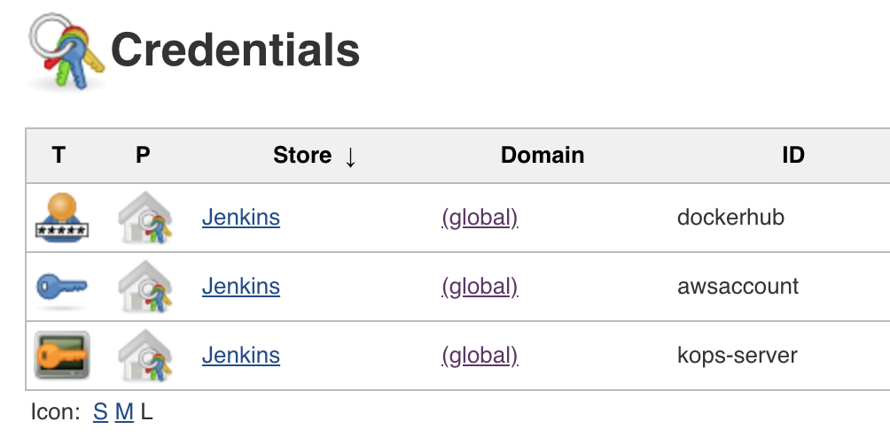
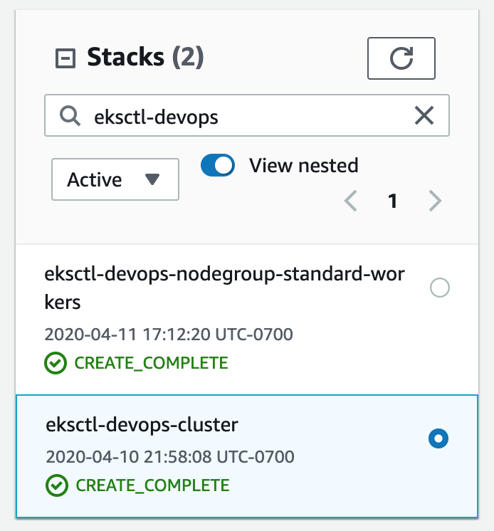

# DevOps Project

*Capstone project for Udacity DevOps Nanodegree program*

--- 

## Set up Jenkins Server & Kops Server

Run a script `./scripts/create.sh` to provision Jenkins server and Kops server via Cloudformation. The script submits a template to Cloudformation with parameters to create a Jenkins server and a Kops server. During boostrap EC2 UserData scripts install necessary libraries and frameworks for Jeknins pipeline operations, Kubenetes, and EKS Cluster.

```
cd templates
create.sh build-pipeline build-pipeline.yaml build-pipeline-parameters.json
```

Post configuration for Jenkins
- Install plugins for Jenkins operations: BlueOcean, Pipeline: Step API, SSH Agent Plugin
- Store credentials for connecting to AWS, DockerHub, and Kops server

Example of Jenkins credentials 



Post-configuration for Kops
- Log into Kops EC2 instance and create a SSH key pair using `ssh-keygen -m PEM` to connect to EKS Linux Worker Nodes

---

## Set up EKS cluster and nodegroup

To create EKS Cluster and Nodegroup, log into Kops server and run following eksctl commands. This will create Cloudformation stacks `eksctl-prod-cluster` and `eksctl-prod-nodegroup-standard-workers`.

Command to create EKS Cluster
```
eksctl create cluster \
 --name prod \
 --region us-west-2 \
 --without-nodegroup
```

Command to create EKS Nodegroup
```
eksctl create nodegroup \
--cluster devops \
--version auto \
--name standard-workers \
--node-type t3.medium \
--nodes 3 \
--nodes-min 1 \
--nodes-max 4 \
--ssh-access \
--ssh-public-key /home/ubuntu/.ssh/id_rsa.pub \
--managed
```

To delete EKS Cluster and Nodegroup, log into Kops server and run following eksctl commands. This will delete Cloudformation stacks `eksctl-devops-cluster` and `eksctl-devops-nodegroup-standard-workers`.

If a LoadBalancer was created by `service.yaml`, remove service before deleting a Nodegroup. Otherwise it prevents Cluster from getting deleted.

Command to delete EKS Nodegroup
```
eksctl delete nodegroup --cluster devops --name standard-workers
```

Command to delete EKS Cluster
```
eksctl delete cluster --name devops
```

Cloudformation stacks of EKS Cluster and Nodegroup created by eksctl commands:



---

## Deployment

Jenkins pipeline manages Blue-Green Deployment. When a pipeline is kicked in Jenkins runs `./scripts/deploy-for-production.sh` with some parameters to begin Blue-Green Deployment.

Parameters of `deploy-for-production.sh`
- DEPLOYMENT_NAME: Name of deployment 
- DEPLOYMENT_FILE: Template of k8s deployment file
- VERSION: Version of application
- SERVICE_NAME: Name of service
- SERVICE_FILE: Template of k8s deployment file

Functionalities of `deploy-for-production.sh`
- Update deployment.yaml and service.yaml with parameters
- Check current deployments to prevent a duplicate
- Apply deployment and service
- Check deployment readiness
- Update service spec
- Check health of service
- Delete Blue Deployment

---

## Screenshots

- cfn-stack-jenkins-kops-servers.png: Cloudformation stack for provisioning jenkins server and kops server
- cfn-stack-eks-cluster-nodegroup.png: Cloudformation stack of EKS Cluster created by eksctl command
- jenkins-pipeline-devops-project.png: Jenkins Blue Ocean dashboard for devops project
- production-1.0.10-jenkins-pipeline.png: Jenkins build for version 1.0.10
- production-1.0.10-k8s.png: K8s outcome of version 1.0.10
- production-1.0.10-web.png: Web page of version 1.0.10
- production-1.0.11-jenkins-pipeline.png: Jenkins build for version 1.0.11
- production-1.0.11-k8s.png: K8s outcome of version 1.0.11
- production-1.0.11-web.png: Web page of version 1.0.11
- master-1.0.11-lint-fail.png: Build failure caused by eslint error
- master-1.0.11-lint-success.png:  Build success after fixing eslint error
- dockerhub-images.png: DockerHub repository for devops-project

--- 

## References

- [Jenkins SSH Agent](https://plugins.jenkins.io/ssh-agent/)
- [Getting Started with eksctl](https://docs.aws.amazon.com/eks/latest/userguide/getting-started-eksctl.html)
- [Deploy to Kubernetes Cluster | CI/CD Kubernetes using Jenkins Pipeline](https://www.youtube.com/watch?v=naUhXrV_rRA&t=650s)
- [Blue/Green Deployments on Kubernetes](https://www.ianlewis.org/en/bluegreen-deployments-kubernetes)

